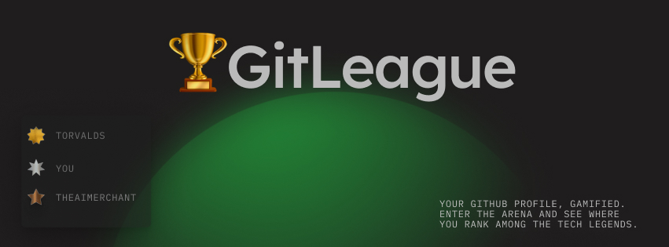

<p align="center">
    
</p>

# 🏆GitLeague
>Your GitHub profile, Gamified. Enter the arena and see where you rank among the tech legends.

<p align="center">
    <a href="https://theaimerchant.github.io/GitLeague/">
        
    </a>
    <br>
    
    
    
</p>

---

## Enter the Arena ⚔️

The idea for **🏆GitLeague** is a tool that turns your GitHub profile into a shareable "Dev Card" to visualise your developer journey and just have some fun! you can also add Dev Cards to your personal 'Dream Team' see how well you work together by checking out your combined score.

## Features
* Uses GitHub api to find your profile.

## Tech Stack

* **Frontend:** HTML5, CSS3 and Vanilla JavaScript.
* **APIs:** The official [GitHub REST API](https://docs.github.com/en/rest) for fetching user data.
* **Libraries:** [SortableJS](https://github.com/SortableJS/Sortable) for the drag-and-drop functionality.
* **Deployment:** Hosted on [GitHub Pages](https://pages.github.com/).

## How To Run Locally

1. **Clone the repository:**
    ```bash
    git clone https://github.com/TheAIMerchant/GitLeague.git
    ```
2. **Navigate to the directory:**
    ```bash
    cd GitLeague
    ```
3. **Open `index.html`** in your browser. That's it!

**Live Demo:**
1. Navigate [Here](https://theaimerchant.github.io/GitLeague/) 
2. Enter your GitHub username.
3. Click "Generate".